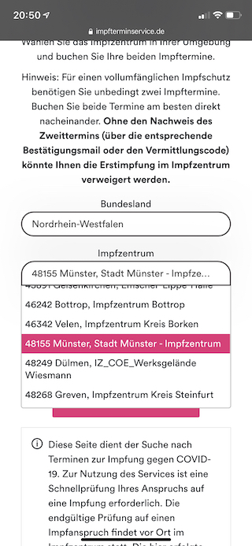
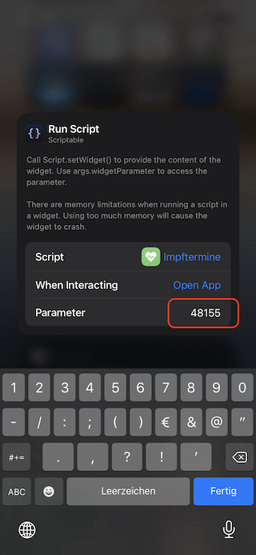
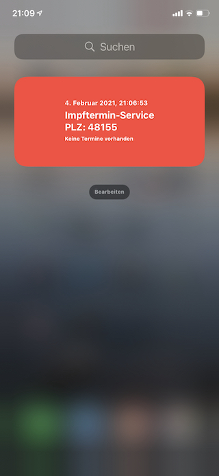
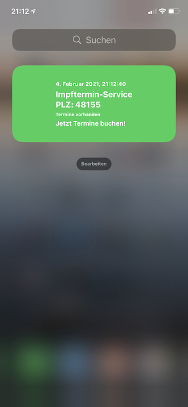

# Impftermine.js
Scriptable Widget für die Prüfung auf vorhandene Impftermine des Patientenservice 116117.

## Voraussetzungen:
- iOS
- Scriptable App: https://scriptable.app/

## Widget Script installieren

- Die Scriptable App für iOS über den App Store installieren
- Den Inhalt des **Impftermine.js** in ein neues Script kopieren **oder**
- Imptermine.js in den iCloud-Ordner iCloud Drive/Scriptable speichern

## Widget einrichten

1. Widgets Screen bearbeiten und neues Scriptable-Widget hinzufügen

2. Impftermine-Script auswählen

3. PLZ des Impfzentrums auf der [Seite des Impfterminservice](https://100-iz.impfterminservice.de/impftermine) heraussuchen.

4. Widget über Scriptable hinzufügen und die PLZ als Parameter übergeben.

## Screenshots

 
*Derzeit sind keine Termine vorhanden*

 
*Termine vorhanden: Widget öffnet die Terminbuchungsseite*

 
*Mitteilung: Tap auf die Mitteilung öffnet Terminbuchungsseite*
